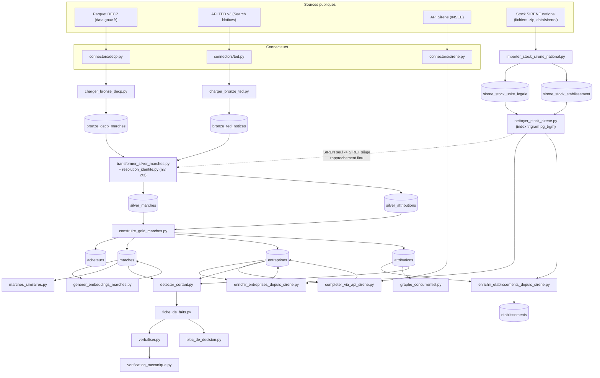

# Rapport de stage — Intelligence concurrentielle sur les marchés publics

**Périmètre couvert par ce rapport :** S1 (partiel — BOAMP non exploré, cf. annexe B) à S5, S7 (verbalisation, porte de vérification, bloc de décision), et la partie de S8 réellement construite (harnais d'évaluation, ce rapport). S6 (agents) et la passerelle LLM sont hors périmètre de cette livraison — documentés en section 8 (Pistes d'extension), pas construits.

**Date de rédaction :** 10/08/2026. Tous les chiffres de ce rapport ont été obtenus en relançant les commandes citées à cette date, sur l'état actuel du dépôt et de la base ; chaque chiffre est accompagné de la commande qui permet de le revérifier.

---

## 1. Contexte et objectif

Une équipe achats/veille concurrentielle qui répond à un marché public informatique manque aujourd'hui d'un moyen rapide de savoir : qui détient probablement le marché en cours, qui sont les concurrents habituels de cet acheteur sur ce type de prestation, et à quel niveau de prix ces marchés se sont historiquement conclus. Ces informations existent dans les données publiques (DECP, TED, SIRENE) mais sont dispersées, hétérogènes dans leurs identifiants, et jamais consolidées automatiquement.

L'objectif de ce stage est de construire un pipeline qui transforme ces sources publiques en un **bloc de décision court, sourcé et honnête sur ce qu'il ne sait pas** — plutôt qu'un texte qui a l'air complet mais invente ou masque ses trous. Le périmètre retenu est celui des services informatiques (CPV 72xxxxxx) en France, sur une fenêtre de données de 3 ans, avec un référentiel d'entreprises (SIRENE) chargé en totalité, national et tous secteurs, car un titulaire de marché informatique peut être immatriculé sous n'importe quel code NAF.

## 2. Architecture générale

Le pipeline suit une architecture **bronze / silver / gold**, implémentée dans `db/schema.sql` et les scripts du dossier `scripts/`.

- **Bronze** (`bronze_decp_marches`, `bronze_ted_notices`) : copie brute des sources, append-only. Une ré-exécution après mise à jour côté source ajoute des lignes sans jamais écraser les précédentes — c'est le mécanisme de versionnement.
- **Silver** (`silver_marches`, `silver_attributions`) : reconstruite en totalité à chaque exécution de `transformer_silver_marches.py`, à partir de la version la plus récente de chaque marché en bronze. Schéma unifié DECP/TED, identifiants résolus via `resolution_identite.py` (niveaux 2 et 3, cf. section 4), doublons inter-sources détectés et flagués sans être supprimés.
- **Gold** (`acheteurs`, `marches`, `entreprises`, `attributions`, `etablissements`) : tables métier peuplées par `construire_gold_marches.py` depuis silver, puis enrichies contre le référentiel SIRENE national par `enrichir_entreprises_depuis_sirene.py` et `enrichir_etablissements_depuis_sirene.py`.



**Tech stack vérifiable** (`requirements.txt`) : PostgreSQL (extensions `pg_trgm` et `vector`/pgvector), SQLAlchemy + psycopg2, DuckDB (filtrage du Parquet DECP côté client), `sentence-transformers` (embeddings locaux), pytest. Aucune dépendance à une API LLM externe.

**Sources connectées vs sources du sujet** : le sujet (section 3) recense 6 sources — SIRENE, TED, DECP, BOAMP, Pappers/Infogreffe, web ouvert. Ce projet en connecte 3 (`connectors/sirene.py`, `connectors/ted.py`, `connectors/decp.py`). BOAMP et Pappers/Infogreffe ne sont ni explorés ni implémentés (aucune trace dans `connectors/` ni dans les scripts de chargement) ; le web ouvert est associé à l'agent d'enrichissement web, non construit (cf. section 3 ci-dessous). Détail en section 8 (Pistes d'extension).

## 3. Frontière déterministe / agentique, et sa justification

Tout ce qui est construit dans ce projet (S1 partiel à S5, S7, la partie faite de S8 — cf. annexe B pour le détail par semaine) est du **code déterministe** : requêtes SQL, règles de normalisation par expression régulière, seuils numériques fixes, gabarit de texte strict (`verbaliser.py` ne contient aucune génération libre, uniquement des f-strings sur des valeurs déjà validées). Rejouer le pipeline sur les mêmes données produit exactement le même résultat.

Le sujet (section 4) prévoit exactement **trois agents**, aucun n'est construit dans ce périmètre. `scripts/harnais_evaluation.py` (fonction `cas_non_implementes`) liste explicitement les deux pièges de la section 8 qui en dépendent, sans les simuler par une règle fragile :

1. **Investigation d'identité** — « quand le SIRET manque et que le rapprochement est ambigu, l'agent enquête (SIRENE, structure de groupe, site de l'entreprise) ». C'est le niveau 4 de la hiérarchie de résolution d'identité (section 4 de ce rapport, ci-dessous). Deux limites du pipeline déterministe en dépendent : l'**homonymie non résoluble par le nom seul** (le rapprochement flou, niveau 3, `pg_trgm`, compare des chaînes de caractères ; quand plusieurs entreprises françaises partagent *exactement* la même dénomination — ex. « SMILE », mesuré à 112 cas réels dans le référentiel SIRENE via `tests/donnees/jeu_test_resolution_identite.csv` — aucun seuil de similarité ne peut les distinguer, car la chaîne comparée est identique pour toutes) ; et le piège « **changement de raison sociale** → résolution correcte OU doute signalé » (distinguer un changement de nom légitime d'une simple homonymie demande de croiser plusieurs indices — continuité du SIREN, cohérence temporelle — et de formuler un degré de confiance argumenté, au-delà d'un seuil de similarité fixe).
2. **Expansion pilotée par la couverture** — « si la couverture est insuffisante, l'agent décide comment élargir la recherche (acheteurs comparables, périmètre géographique, CPV parent, fenêtre temporelle), réévalue, et sait conclure que les données sont insuffisantes ». Couvre le piège « **marché passé par une centrale d'achat** → limite de couverture signalée » : un marché notifié par une centrale d'achat est rattaché en base au SIRET de la centrale, pas à l'organisme réellement bénéficiaire ; reconnaître ce cas et décider d'élargir la recherche ou de signaler la limite est un jugement contextuel, pas une jointure.
3. **Enrichissement web** — seul cas où une recherche sur corpus ouvert est justifiée selon le sujet, conçu en dégradation gracieuse (un échec ne dégrade jamais le briefing en dessous de ce que les sources structurées permettent déjà). Le déroulement du sujet (section 6) le rend explicitement optionnel pour S6 (*« agent web si le temps le permet »*) ; il n'est associé à aucun piège spécifique de la section 8.

Ce choix de périmètre est défendable comme une **frontière de nature**, pas seulement une limite de temps : les parties construites (S1 partiel, S2-S5, S7, S8 partiel) sont toutes des transformations reproductibles d'une donnée déjà présente en base vers une autre donnée déterminée sans ambiguïté par des règles fixes. Les trois agents ci-dessus demandent au contraire de peser des indices contradictoires ou incomplets et d'assumer un jugement — exactement la distinction que `scripts/harnais_evaluation.py` matérialise en listant les deux pièges dépendants comme `NON IMPLÉMENTÉ` plutôt que de les simuler.

## 4. Résolution d'identité

Implémentée dans `scripts/resolution_identite.py`, appelée par `transformer_silver_marches.py` pour tout identifiant qui échoue au niveau 1 (SIRET exact 14 chiffres).

- **Niveau 2 — normalisation (déterministe)** : suppression des espaces internes, éclatement des champs multi-valeurs (plusieurs SIRET concaténés dans un même champ — co-traitance cachée), résolution d'un SIREN seul vers le SIRET du siège via `sirene_stock_etablissement`, extraction du SIREN depuis une TVA intracommunautaire française, détection d'une TVA étrangère (catégorisée `etranger`, jamais confondue avec un résultat français).
- **Niveau 3 — rapprochement flou (probabiliste)** : uniquement si le niveau 2 échoue et qu'un nom est disponible. `similarity()` (`pg_trgm`) contre `sirene_stock_unite_legale`, seuil 0.55, meilleur candidat retenu avec son score (`score_confiance`), jamais un résultat sans score.

**Méthodologie du jeu de test** : `tests/donnees/jeu_test_resolution_identite.csv`, 39 cas (confirmé par comptage de lignes du fichier), construits à partir de couples (nom, SIREN) réels vérifiés contre le référentiel SIRENE, complétés par des cas ciblant les pièges du sujet. Mesuré par `python scripts/mesurer_precision_resolution.py` — résultat obtenu en relançant cette commande le 10/08/2026 :

| Catégorie | Résultat |
|---|---|
| `niveau2_espaces` | 1/1 (100%) |
| `niveau2_prefixe` | 1/1 (100%) |
| `niveau2_multivaleurs` | 1/1 (100%) |
| `niveau2_siren_seul` | 1/1 (100%) |
| `niveau2_tva_fr` | 1/1 (100%) |
| `niveau2_etranger` | 2/2 (100%) |
| `niveau3_flou` | 18/18 (100%) |
| `niveau3_flou_parenthese` | 2/2 (100%) |
| `niveau3_flou_forme_juridique` | 2/2 (100%) |
| `niveau3_flou_forme_juridique_construit` | 2/2 (100%) |
| `niveau3_flou_ambigu` (homonymie réelle) | 2/6 (33%) |
| `impossible_par_nom` | 0/1 (0%) |
| `impossible` (entreprise inexistante) | 1/1 (100%) |
| **Niveau 2 (agrégé)** | **7/7 (100%)** |
| **Niveau 3 (agrégé, inclut `ambigu` et `impossible*`)** | **27/32 (84%)** |
| **Global** | **34/39 (87%)** |
| **Hors homonymie (`ambigu` exclus)** | **32/33 (97%)** |

**Analyse honnête des échecs** :
- `niveau3_flou_ambigu` (2/6, 33%) : cas d'homonymie réelle où plusieurs entreprises françaises partagent exactement la même dénomination (ex. « SMILE », 112 cas mesurés dans le référentiel). Le rapprochement par similarité de chaîne ne peut structurellement pas les départager — c'est précisément le cas réservé au niveau 4 (agent), cf. section 3.
- `impossible_par_nom` (0/1) : cas d'un entrepreneur individuel dont le champ `denominationUniteLegale` est vide dans le stock SIRENE (les personnes physiques y sont enregistrées sous des champs nom/prénom, pas dénomination) — un échec structurel de l'approche par nom, différent de l'homonymie, et non couvert par le seuil de similarité.

La cible du sujet (>90%, France) est atteinte hors homonymie (97%) mais pas sur le chiffre global (87%) — écart documenté tel quel, cause identifiée précisément ci-dessus, pas masqué derrière une moyenne unique.

## 5. Détection du sortant et chaînes de renouvellement

Implémentée dans `scripts/detecter_sortant.py`. Pour un couple (acheteur, CPV), la fonction `detecter_sortant()` :

1. Regroupe les marchés au niveau `uid` (un accord-cadre à plusieurs titulaires ne compte qu'une fois dans la chaîne temporelle, même si `historique` conserve le détail par titulaire).
2. Pour chaque marché, calcule une date de fin **estimée** : `date_notification` + durée. La durée utilisée est soit la durée **réellement publiée** par la source (`duree_mois`, champ DECP — jamais disponible pour TED, cf. limites section 7), soit, si absente, la **durée médiane observée sur ce même code CPV** tous acheteurs confondus (`_duree_mediane_cpv`). Chaque résultat porte son `duree_source` (`"reelle"` ou `"inferee_famille_cpv"`) et **aucune durée n'est inventée** si ni l'une ni l'autre n'est disponible (`date_fin_estimee = None`).
3. Regroupe les marchés notifiés à moins de 30 jours d'intervalle (`FENETRE_GENERATION_JOURS`) en une même « vague » de notification (plusieurs lots d'un accord-cadre attribués ensemble ne doivent pas être lus comme une séquence de renouvellement).
4. Évalue la cohérence de la chaîne : une transition entre deux vagues est jugée cohérente si l'écart entre fin estimée et vague suivante reste sous 6 mois (`SEUIL_COHERENCE_MOIS`). Le niveau de confiance (`aucune`/`faible`/`moyenne`/`élevée`) dépend du nombre de vagues **et** du taux de cohérence de la chaîne, pas seulement du volume de marchés — un acheteur avec de nombreux marchés temporellement incohérents sur un CPV générique n'obtient jamais `élevée`.

Ce mécanisme se propage dans `fiche_de_faits.py`, qui dégrade explicitement la couverture d'un fait quand la donnée sous-jacente est estimée plutôt que publiée (`couverture_expiration` réduite de moitié si la durée est inférée par médiane CPV, nulle si aucune durée n'est disponible) — jamais un chiffre calculé présenté avec la même certitude qu'une donnée source.

## 6. Métriques

**Le sujet a été fourni en texte intégral au cours de cette rédaction** (section 8 : tableau de 6 métriques — taux d'affirmations sourcées, taux d'hallucination, précision résolution d'identité, précision détection du sortant, couverture, coût/latence par briefing — et 5 pièges de démonstration). Le tableau ci-dessous reprend l'intégralité des 5 pièges et des 6 métriques : mesurées par un script quand c'est possible, garanties par construction du code sinon, ou signalées explicitement comme non mesurées — jamais omises. Chaque ligne mesurée est vérifiée par une commande reproductible, relancée le 10/08/2026.

| Exigence (section 8) | Cible | Mesure au 10/08/2026 | Commande |
|---|---|---|---|
| Précision résolution d'identité (France) | > 90% | **87%** global / **97%** hors homonymie | `python scripts/mesurer_precision_resolution.py` |
| Piège « Acheteur sans historique » → données insuffisantes | déclenchement réel | **PASS** | `python scripts/harnais_evaluation.py` |
| Piège « Concurrent hors France » → dégradé + déclaré | déclenchement réel, pas simulé | **PASS** — déclaré=True, dégradé=True (couverture=0.33), compté=True | `python scripts/harnais_evaluation.py` |
| Piège « CPV mal saisi » → complété par similarité | déclenchement réel | **PASS** — cas découvert dynamiquement (CPV 72267100), 5 marchés à CPV différent retournés avec score, meilleur cas ≥ 0.6 trouvé | `python scripts/harnais_evaluation.py` |
| Piège « Changement de raison sociale » → résolution correcte OU doute signalé | — | **NON IMPLÉMENTÉ** (agent Investigation d'identité, S6, hors périmètre — cf. section 3) | `python scripts/harnais_evaluation.py` |
| Piège « Marché passé par une centrale d'achat » → limite de couverture signalée | — | **NON IMPLÉMENTÉ** (agent Expansion pilotée par la couverture, S6, hors périmètre — cf. section 3) | `python scripts/harnais_evaluation.py` |
| Taux d'affirmations sourcées | 100% | **100% par construction** — chaque entrée de `faits` dans `fiche_de_faits.py` porte un champ `provenance` non vide, sans exception dans le code (pas de branche produisant une valeur sans provenance) | — (garanti par la structure du code, aucun script ne calcule de taux) |
| Anti-hallucination (aucun chiffre non sourcé dans le texte généré) | 0 chiffre non justifié | **PASS** | `python scripts/harnais_evaluation.py` (+ `pytest tests/test_verification_mecanique.py`) |
| Couverture jamais présentée comme 100% trompeur | — | **PASS** | `python scripts/harnais_evaluation.py` |
| Bloc de décision ≤ 10 lignes | ≤ 10 lignes | **PASS** — 8 lignes sur le cas testé | `python scripts/harnais_evaluation.py` |
| Cohérence référentiel SIRENE (stock, enrichissement, orphelins) | 8 contrôles | **8/8** | `python scripts/verification_finale_sirene.py` |
| Suite de tests | — | **33/33 passed** (31 tests fonctionnels initiaux + 2 tests de régression ajoutés le 10/08 sur un cas de plantage corrigé, cf. `git log`) | `pytest tests/` |
| Précision de détection du sortant, sur cas connus | mesurée | **Non mesurée** — `tests/test_detecter_sortant.py` ne vérifie que la cohérence structurelle du résultat (2 tests), aucun jeu de cas annotés à réponse connue équivalent à `mesurer_precision_resolution.py` | — (aucun script ne la mesure) |
| Coût et latence par briefing | mesurés | **Non mesurés** — aucun script du dépôt ne chronomètre ni ne chiffre l'exécution d'un briefing | — (aucun script ne les mesure) |

## 7. Limites de données assumées

Synthèse de la section « Limites de données connues » du `README.md`, revérifiée à la date de ce rapport :

- **Homonymie non résoluble par le nom seul** : précision mesurée à 33% sur ce sous-type (cf. section 4), réservée au niveau 4 (agent), hors périmètre.
- **25 marchés (9 DECP + 16 TED) sans acheteur exploitable** même après les niveaux 2/3 de résolution.
- **Chevauchement DECP/TED** : 41 doublons probables inter-sources détectés et flagués (`doublon_probable_de`), jamais supprimés silencieusement ; la ligne DECP est retenue comme référence en gold.
- **TED : dates simplifiées** — `date_notification` et `date_publication` prennent la même valeur (l'API ne distingue pas ces deux dates au niveau du champ utilisé) ; `duree_mois`/`duree_restante_mois` restent `NULL` pour tous les marchés TED (aucune durée inférée pour ne pas fabriquer une donnée absente au niveau de la table `marches` — l'inférence par médiane CPV n'intervient qu'en aval, dans `detecter_sortant.py`, cf. section 5).
- **7 entreprises marquées `INTROUVABLE_API`** (404 sur l'API Sirene au moment du passage) : à traiter par un futur agent d'investigation d'identité hors SIRENE.
- **86 SIRET titulaires sans établissement correspondant** dans le stock national (établissement fermé/radié avant l'historique disponible, ou SIRET mal saisi côté source).
- **Rapprochement flou potentiellement lent** sur les noms courts/fréquents (`similarity()` contre ~29,8M lignes), sans cache entre appels identiques au sein d'une même exécution — acceptable au volume actuel, à revoir si le volume grossit significativement.
- **Bronze non purgé automatiquement** : chaque exécution des scripts de chargement ajoute des lignes sans purge des versions anciennes — acceptable à l'échelle du stage, une politique de rétention serait nécessaire en production.
- **Filiales non modélisées** dans `graphe_concurrentiel.py` : aucun dataset de liens de succession/structure de groupe n'est chargé dans ce projet ; une heuristique par adresse/préfixe SIREN produirait des rapprochements non fiables, documentée comme limite plutôt que simulée.

## 8. Pistes d'extension

Reprise et mise en contexte de la section « Prochaines étapes » du README (`README.md`, section du même nom) :

- **S6 — Agents** (investigation d'identité, expansion pilotée par la couverture, enrichissement web optionnel) : les trois agents justifiés en section 3. Les deux pièges de la section 8 qui en dépendent (changement de raison sociale, centrale d'achat) restent visibles comme `NON IMPLÉMENTÉ` dans `scripts/harnais_evaluation.py` plutôt que masqués, pour que l'écart reste mesurable à chaque exécution du harnais.
- **Passerelle LLM** : aucune n'est configurée dans ce projet. Prérequis technique aux trois agents S6. Les embeddings (S4) utilisent volontairement un modèle local (`sentence-transformers`) pour ne pas en dépendre ; la verbalisation (S7) reste un gabarit texte strict, pas une génération par LLM.
- **Pondération acheteur (prix/technique)** : le fait `ponderation_acheteur` existe déjà dans `fiche_de_faits.py` (couverture toujours à 0.0, valeur `"non disponible"`), en attente d'une source de données supplémentaire (ex. règlement de consultation / CCTP du marché) qu'aucun connecteur actuel ne fournit.
- **Sources BOAMP et Pappers/Infogreffe** (sujet, section 3) : sur les 6 sources recensées par le sujet, seules SIRENE, TED et DECP sont connectées (section 2 ci-dessus). BOAMP (recoupement/détection, exploration à la main demandée dès S1) et Pappers/Infogreffe (santé financière, API payante à couverture partielle selon le sujet) restent à explorer et connecter.
- **Précision de détection du sortant et coût/latence par briefing** (sujet, section 8) : deux des 6 métriques cibles n'ont pas de script de mesure dédié (cf. section 6 ci-dessus). `detecter_sortant.py` manque d'un jeu de cas annotés à réponse connue équivalent à celui de la résolution d'identité ; aucun script ne mesure le coût ou la latence d'un briefing.

## Annexe

### A. Instructions de reproduction

```bash
# Installation
python3.11 -m venv venv && source venv/bin/activate
pip install -r requirements.txt
# copier .env.example vers .env, renseigner DATABASE_URL et SIRENE_API_KEY
# installer pgvector, puis : psql -U stage_user -d marches_publics -f db/schema.sql

# Les 4 commandes de vérification citées dans ce rapport
pytest tests/
python scripts/harnais_evaluation.py
python scripts/mesurer_precision_resolution.py
python scripts/verification_finale_sirene.py
```

Détail du pipeline de données complet (10 étapes, ordre d'exécution) : voir `README.md`, section « Pipeline de données ».

### B. Tableau récapitulatif des 8 semaines du sujet

Mapping S1-S8 repris du texte intégral du sujet (section 6, tableau de déroulement), fourni au cours de cette rédaction — et non plus déduit par recoupement de citations éparses dans le code comme dans une version précédente de ce rapport.

| Semaine | Objectif et livrable (sujet, section 6) | État vérifié | Preuve |
|---|---|---|---|
| S1 | Cadrage (exploration TED/DECP/BOAMP, schéma unifié, France seule ou France+UE) → note d'exploration et schéma cible | 🟡 | TED/DECP explorés et connectés (`connectors/ted.py`, `connectors/decp.py`), schéma cible peuplé (`db/schema.sql`) ; **BOAMP non exploré, non connecté** (cf. section 8) ; France seule tranchée en code (`connectors/ted.py`, filtre `buyer-country=FRA`), pas dans une note d'exploration séparée |
| S2 | Ingestion TED/DECP CPV restreint, bronze/silver/gold, déduplication, versionnement → base interrogeable, volumétrie documentée | ✅ | `pytest tests/test_bronze_silver_gold.py` passe (3 tests) ; volumétrie au README |
| S3 | SIRENE et résolution d'identité, jeu de test annoté → précision de résolution mesurée | ✅ | 87% global / 97% hors homonymie, cf. section 4 |
| S4 | Embeddings d'objets de marché, couche graphe, requêtes récursives → marchés similaires et traversées fonctionnels | ✅ | `pytest tests/test_marches_similaires.py tests/test_graphe_concurrentiel.py` passe ; couverture embeddings 100% (cf. README) |
| S5 | Détection du sortant, fréquences, distributions de prix, profil acheteur, métriques de couverture → fiche de faits complète sur un vrai marché | ✅ | `detecter_sortant.py` + `fiche_de_faits.py`, `pytest tests/test_detecter_sortant.py` passe, cf. section 5 |
| S6 | Agents d'expansion et d'identité (agent web si le temps le permet) → couverture améliorée sur les cas pauvres | ⛔ | Non implémenté par choix assumé (section 3) ; les 2 pièges qui en dépendent restent `NON IMPLÉMENTÉ` dans `harnais_evaluation.py` |
| S7 | Verbalisation, porte de vérification, bloc de décision, rapport détaillé → briefing lisible en 30 secondes | ✅ | `verbaliser.py`, `verification_mecanique.py`, `bloc_de_decision.py` ; `pytest tests/test_verification_mecanique.py tests/test_bloc_de_decision.py` passe (8 tests) |
| S8 | Harnais d'évaluation, mesures, rapport, démonstration → rapport, démo et README | 🟡 | Harnais fonctionnel (8/8, `harnais_evaluation.py`), mesures partielles (`mesurer_precision_resolution.py`, `verification_finale_sirene.py` ; **précision du sortant et coût/latence par briefing non mesurés**, cf. section 6) ; ce rapport est un premier brouillon non validé ; aucune démonstration (artefact de présentation) n'existe dans le dépôt — non vérifiable depuis le code seul |

---

## Points non vérifiés directement — à valider avant diffusion

Liste des affirmations que je n'ai **pas** pu confirmer par le code, les tests ou une commande, et qui sont donc formulées avec prudence ou signalées comme telles dans le corps du rapport plutôt qu'affirmées :

1. ~~Le texte exact du sujet n'est pas accessible depuis ce contexte~~ — **résolu** : le texte intégral du sujet a été fourni au cours de la rédaction de ce rapport. Les sections 3, 6, 8 et l'annexe B ont été corrigées sur cette base (nom exact des 3 agents — investigation d'identité, expansion pilotée par la couverture, enrichissement web — et contenu réel du tableau de déroulement S1-S8). Réserve restante : ce texte m'a été transmis sous forme de texte collé dans la conversation, pas récupéré depuis un document source que j'aurais pu ouvrir moi-même ; je n'ai donc aucun moyen de vérifier qu'il s'agit d'une transcription complète et fidèle de l'énoncé officiel de votre établissement. Le texte contenait par ailleurs plusieurs graphies visiblement altérées (probable OCR ou dictée) que j'ai interprétées par contexte sans confirmation possible : *« siller »* → silver, *« visionnement »* → versionnement, *« efforts »* → eForms, *« lamp (XML forms) »* → probablement lxml, *« Panic »* → probablement Pydantic, *« Lang Graph »* → LangGraph, *« pattes »* → pytest, *« Geo »* dans *« GO/No-Geo »* → probablement No-Go. Si l'une de ces lectures est fausse, les sections 2 et 9 de ce rapport en hériteraient l'erreur.
2. ~~Contenu précis de S6, S7 et S8~~ — **résolu** par le même texte : voir annexe B, reprise directement du tableau de déroulement du sujet (section 6).
3. ~~Ce qui s'est réellement passé lors des deux commits `dc153e3` et `61411d7`, tous deux intitulés à l'identique « Partie 4 : fiche de faits, verbalisation par gabarit, verification mecanique anti-hallucination »~~ — **vérifié après coup** (`git diff dc153e3 61411d7 --stat`) : ce ne sont pas des doublons, le second ajoute 7 lignes à `tests/test_verification_mecanique.py`. Point retiré de la liste des incertitudes, gardé ici pour traçabilité de la vérification.
4. **Le contexte organisationnel du stage** (entreprise d'accueil, encadrant, dates de début/fin du stage) : aucune information de ce type n'existe dans le dépôt ; ce rapport ne contient donc aucune page de garde ni section administrative — à compléter par vous si votre établissement l'exige.
