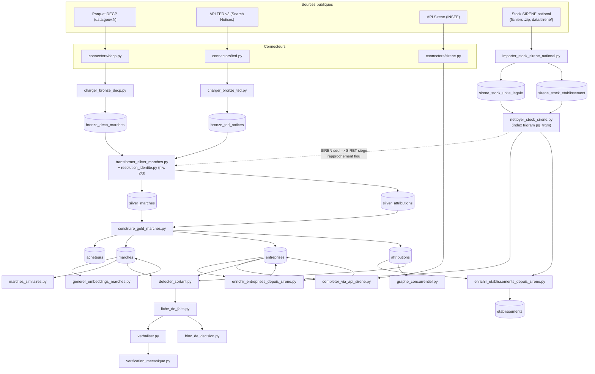

# Rapport de stage — Intelligence concurrentielle sur les marchés publics

**Périmètre couvert par ce rapport :** S1 (partiel — BOAMP non exploré, cf. annexe B) à S5, S6 (2 des 3 agents du sujet — expansion pilotée par la couverture et investigation d'identité — cf. sections 3, 10 et 11), S7 (verbalisation, porte de vérification, bloc de décision), et la partie de S8 réellement construite (harnais d'évaluation, ce rapport). Seul l'agent d'enrichissement web (explicitement optionnel selon le sujet) et la passerelle LLM générale restent hors périmètre — documentés en section 8 (Pistes d'extension), pas construits.

**Date de rédaction :** 10/08/2026, mis à jour le 18/08/2026 (cf. section 11). Tous les chiffres de ce rapport ont été obtenus en relançant les commandes citées à leur date respective, sur l'état du dépôt et de la base à ce moment ; chaque chiffre est accompagné de la commande qui permet de le revérifier.

---

## 1. Contexte et objectif

Une équipe achats/veille concurrentielle qui répond à un marché public informatique manque aujourd'hui d'un moyen rapide de savoir : qui détient probablement le marché en cours, qui sont les concurrents habituels de cet acheteur sur ce type de prestation, et à quel niveau de prix ces marchés se sont historiquement conclus. Ces informations existent dans les données publiques (DECP, TED, SIRENE) mais sont dispersées, hétérogènes dans leurs identifiants, et jamais consolidées automatiquement.

L'objectif de ce stage est de construire un pipeline qui transforme ces sources publiques en un **bloc de décision court, sourcé et honnête sur ce qu'il ne sait pas** — plutôt qu'un texte qui a l'air complet mais invente ou masque ses trous. Le périmètre retenu est celui des services informatiques (CPV 72xxxxxx) en France, sur une fenêtre de données de 3 ans, avec un référentiel d'entreprises (SIRENE) chargé en totalité, national et tous secteurs, car un titulaire de marché informatique peut être immatriculé sous n'importe quel code NAF.

## 2. Architecture générale

Le pipeline suit une architecture **bronze / silver / gold**, implémentée dans `db/schema.sql` et les scripts du dossier `scripts/`.

- **Bronze** (`bronze_decp_marches`, `bronze_ted_notices`) : copie brute des sources, append-only. Une ré-exécution après mise à jour côté source ajoute des lignes sans jamais écraser les précédentes — c'est le mécanisme de versionnement.
- **Silver** (`silver_marches`, `silver_attributions`) : reconstruite en totalité à chaque exécution de `transformer_silver_marches.py`, à partir de la version la plus récente de chaque marché en bronze. Schéma unifié DECP/TED, identifiants résolus via `resolution_identite.py` (niveaux 2 et 3, cf. section 4), doublons inter-sources détectés et flagués sans être supprimés.
- **Gold** (`acheteurs`, `marches`, `entreprises`, `attributions`, `etablissements`) : tables métier peuplées par `construire_gold_marches.py` depuis silver, puis enrichies contre le référentiel SIRENE national par `enrichir_entreprises_depuis_sirene.py` et `enrichir_etablissements_depuis_sirene.py`.



**Tech stack vérifiable** (`requirements.txt`) : PostgreSQL (extensions `pg_trgm` et `vector`/pgvector), SQLAlchemy + psycopg2, DuckDB (filtrage du Parquet DECP côté client), `sentence-transformers` (embeddings locaux), pytest. Aucune dépendance à une API LLM externe.

**Sources connectées vs sources du sujet** : le sujet (section 3) recense 6 sources — SIRENE, TED, DECP, BOAMP, Pappers/Infogreffe, web ouvert. Ce projet en connecte 3 (`connectors/sirene.py`, `connectors/ted.py`, `connectors/decp.py`). BOAMP et Pappers/Infogreffe ne sont ni explorés ni implémentés (aucune trace dans `connectors/` ni dans les scripts de chargement) ; le web ouvert est associé à l'agent d'enrichissement web, non construit (cf. section 3 ci-dessous). Détail en section 8 (Pistes d'extension).

## 3. Frontière déterministe / agentique, et sa justification

Tout ce qui est construit dans ce projet (S1 partiel à S5, S7, la partie faite de S8 — cf. annexe B pour le détail par semaine) est du **code déterministe** : requêtes SQL, règles de normalisation par expression régulière, seuils numériques fixes, gabarit de texte strict (`verbaliser.py` ne contient aucune génération libre, uniquement des f-strings sur des valeurs déjà validées). Rejouer le pipeline sur les mêmes données produit exactement le même résultat.

Le sujet (section 4) prévoit exactement **trois agents**. Deux sont désormais implémentés (expansion pilotée par la couverture, le 16/08/2026 ; investigation d'identité, le 18/08/2026), sans passerelle LLM (aucune n'est configurée dans ce projet) : le « jugement » y est une procédure déterministe qui interroge la base et, pour l'investigation d'identité, l'API SIRENE — ce que demande littéralement le sujet, sans génération de texte libre. Seul l'enrichissement web reste hors périmètre. `scripts/harnais_evaluation.py` (fonction `cas_non_implementes`) est désormais vide : les 5 pièges de la section 8 sont tous couverts.

1. **Investigation d'identité — implémentée** (`scripts/agent_investigation_identite.py`, cf. section 11). « quand le SIRET manque et que le rapprochement est ambigu, l'agent enquête (SIRENE, structure de groupe, site de l'entreprise) ». C'est le niveau 4 de la hiérarchie de résolution d'identité (section 4 de ce rapport, ci-dessous) — le sujet le qualifie de *« le plus rentable des trois, car l'identité est le principal risque qualité »*. Deux mécanismes réels, sans recherche web générique (réservée au 3e agent, hors périmètre) : **4a — continuité de marché** (SQL pur : un acheteur qui a déjà attribué un marché à l'un de plusieurs candidats homonymes devient le signal de désambiguïsation) et **4b — historique de dénomination via l'API SIRENE** (opérateur `periode()` de l'API v3.11, couvre le piège « **changement de raison sociale** → résolution correcte OU doute signalé », vérifié sur un cas réel : France Télécom → Orange, 2013, même SIREN 380129866). En construisant ce mécanisme, un bug de fausse confiance a été découvert et corrigé dans le niveau 3 lui-même (cf. section 11) : en cas d'homonymie exacte, l'ancien code retournait un candidat arbitraire à confiance pleine plutôt que de signaler l'ambiguïté.
2. **Expansion pilotée par la couverture — implémentée** (`scripts/agent_expansion_couverture.py`). « si la couverture est insuffisante, l'agent décide comment élargir la recherche (acheteurs comparables, périmètre géographique, CPV parent, fenêtre temporelle), réévalue, et sait conclure que les données sont insuffisantes ». Axes couverts : CPV parent (seul axe pouvant changer le sortant retourné lui-même — les autres n'élargissent que les statistiques de prix/concurrents), acheteurs comparables même NAF (département puis national, via le référentiel SIRENE), fenêtre temporelle constatée comme un no-op à ce niveau (documenté en commentaire, pas simulée — `detecter_sortant()` n'applique déjà aucun filtre de date). Couvre le piège « **marché passé par une centrale d'achat** → limite de couverture signalée » : un marché notifié par une centrale d'achat est rattaché en base au SIRET de la centrale, pas à l'organisme réellement bénéficiaire ; ce cas est désormais détecté **avant** toute logique de couverture dans `fiche_de_faits.py` (cf. section 10, un bug de gating trouvé et corrigé le 16/08/2026), et testé automatiquement par le harnais.
3. **Enrichissement web — non implémentée.** Seul cas où une recherche sur corpus ouvert est justifiée selon le sujet, conçu en dégradation gracieuse (un échec ne dégrade jamais le briefing en dessous de ce que les sources structurées permettent déjà). Le déroulement du sujet (section 6) le rend explicitement optionnel pour S6 (*« agent web si le temps le permet »*) ; il n'est associé à aucun piège spécifique de la section 8.

Le choix de ne pas construire ce dernier agent est défendable comme une **frontière de nature**, pas seulement une limite de temps : la majorité de ce qui est construit (S1 partiel, S2-S5, S7, S8 partiel) reste des transformations reproductibles d'une donnée déjà présente en base vers une autre donnée déterminée sans ambiguïté par des règles fixes. Les deux agents désormais construits montrent qu'un agent au sens du sujet (une décision dans un espace de recherche ouvert, avec réévaluation) ne présuppose pas une passerelle LLM quand l'espace de décision reste énumérable (quel axe essayer, quand s'arrêter) ou ancré dans une source vérifiable (l'historique SIRENE plutôt qu'une recherche web ouverte). L'enrichissement web, lui, demande de peser des indices contradictoires issus d'un corpus non structuré — une nature différente, hors périmètre assumé.

## 4. Résolution d'identité

Implémentée dans `scripts/resolution_identite.py`, appelée par `transformer_silver_marches.py` pour tout identifiant qui échoue au niveau 1 (SIRET exact 14 chiffres).

- **Niveau 2 — normalisation (déterministe)** : suppression des espaces internes, éclatement des champs multi-valeurs (plusieurs SIRET concaténés dans un même champ — co-traitance cachée), résolution d'un SIREN seul vers le SIRET du siège via `sirene_stock_etablissement`, extraction du SIREN depuis une TVA intracommunautaire française, détection d'une TVA étrangère (catégorisée `etranger`, jamais confondue avec un résultat français).
- **Niveau 3 — rapprochement flou (probabiliste)** : uniquement si le niveau 2 échoue et qu'un nom est disponible. `similarity()` (`pg_trgm`) contre `sirene_stock_unite_legale`, seuil 0.55, meilleur candidat retenu avec son score (`score_confiance`), jamais un résultat sans score. **Correctif du 18/08/2026** (cf. section 11) : en cas d'égalité au score maximum (homonymie exacte), l'ancien code retournait un candidat arbitraire à confiance pleine (1.0) — corrigé pour signaler explicitement l'ambiguïté plutôt que deviner.
- **Niveau 4 — investigation d'identité (agent, implémenté le 18/08/2026, `scripts/agent_investigation_identite.py`)** : cf. section 11 pour le détail. 4a, continuité de marché (SQL) ; 4b, historique de dénomination via l'API SIRENE.

**Méthodologie du jeu de test** : `tests/donnees/jeu_test_resolution_identite.csv`, 39 cas (confirmé par comptage de lignes du fichier), construits à partir de couples (nom, SIREN) réels vérifiés contre le référentiel SIRENE, complétés par des cas ciblant les pièges du sujet. Mesuré par `python scripts/mesurer_precision_resolution.py` (niveau 4b activé) — résultat obtenu en relançant cette commande le 18/08/2026 :

| Catégorie | Résultat |
|---|---|
| `niveau2_espaces` | 1/1 (100%) |
| `niveau2_prefixe` | 1/1 (100%) |
| `niveau2_multivaleurs` | 1/1 (100%) |
| `niveau2_siren_seul` | 1/1 (100%) |
| `niveau2_tva_fr` | 1/1 (100%) |
| `niveau2_etranger` | 2/2 (100%) |
| `niveau3_flou` | 18/18 (100%) |
| `niveau3_flou_parenthese` | 2/2 (100%) |
| `niveau3_flou_forme_juridique` | 2/2 (100%) |
| `niveau3_flou_forme_juridique_construit` | 2/2 (100%) |
| `niveau3_flou_ambigu` (homonymie réelle) | 2/6 (33%) |
| `impossible_par_nom` | 0/1 (0%) |
| `impossible` (entreprise inexistante) | 1/1 (100%) |
| **Niveau 2 (agrégé)** | **7/7 (100%)** |
| **Niveau 3 (agrégé, inclut `ambigu` et `impossible*`)** | **27/32 (84%)** |
| **Global** | **34/39 (87%)** |
| **Hors homonymie (`ambigu` exclus)** | **32/33 (97%)** |

**Analyse honnête des échecs, avec le niveau 4 désormais actif** : le score `niveau3_flou_ambigu` reste 2/6 (33%) — **identiquement** au chiffre d'avant le correctif du 18/08, mais pour une raison qualitativement différente, vérifiée cas par cas (`AYALINE`, `IDA CONCEPT`, `SMILE`, `BELHARRA`, `DOUBLET`, `GEXPERTISE`) :
  - 2 cas (`AYALINE`, `IDA CONCEPT`) sont désormais résolus **légitimement** par le niveau 4b : la bonne entreprise a, vérifié via l'API SIRENE, une période *passée* (`dateFin` renseignée) portant exactement ce nom, que l'homonyme concurrent n'a pas — une vraie désambiguïsation, pas une coïncidence de tri SQL.
  - 4 cas (`SMILE` — 112 homonymes réels mesurés dans le référentiel —, `BELHARRA`, `DOUBLET`, `GEXPERTISE`) échouent désormais **honnêtement** (liste vide, ambiguïté signalée) au lieu d'un résultat qui pouvait auparavant être juste par chance de tri SQL entre ex-aequo, ou faux mais présenté avec une confiance de 1.0 — c'est précisément le cas que le sujet réserve au niveau 4, ici tenté et honnêtement insuffisant faute de contexte acheteur (niveau 4a inapplicable dans ce jeu de test isolé) et d'historique de renommage exploitable (niveau 4b).
- `impossible_par_nom` (0/1) : cas d'un entrepreneur individuel dont le champ `denominationUniteLegale` est vide dans le stock SIRENE (les personnes physiques y sont enregistrées sous des champs nom/prénom, pas dénomination) — un échec structurel de l'approche par nom, différent de l'homonymie, et non couvert par le seuil de similarité ni par le niveau 4.

La cible du sujet (>90%, France) est atteinte hors homonymie (97%) mais pas sur le chiffre global (87%) — écart documenté tel quel, cause identifiée précisément ci-dessus, pas masqué derrière une moyenne unique. Le point notable : le niveau 4 ne change pas le chiffre global, mais élimine la fausse confiance qui s'y cachait — un résultat plus honnête à score identique.

## 5. Détection du sortant et chaînes de renouvellement

Implémentée dans `scripts/detecter_sortant.py`. Pour un couple (acheteur, CPV), la fonction `detecter_sortant()` :

1. Regroupe les marchés au niveau `uid` (un accord-cadre à plusieurs titulaires ne compte qu'une fois dans la chaîne temporelle, même si `historique` conserve le détail par titulaire).
2. Pour chaque marché, calcule une date de fin **estimée** : `date_notification` + durée. La durée utilisée est soit la durée **réellement publiée** par la source (`duree_mois`, champ DECP — jamais disponible pour TED, cf. limites section 7), soit, si absente, la **durée médiane observée sur ce même code CPV** tous acheteurs confondus (`_duree_mediane_cpv`). Chaque résultat porte son `duree_source` (`"reelle"` ou `"inferee_famille_cpv"`) et **aucune durée n'est inventée** si ni l'une ni l'autre n'est disponible (`date_fin_estimee = None`).
3. Regroupe les marchés notifiés à moins de 30 jours d'intervalle (`FENETRE_GENERATION_JOURS`) en une même « vague » de notification (plusieurs lots d'un accord-cadre attribués ensemble ne doivent pas être lus comme une séquence de renouvellement).
4. Évalue la cohérence de la chaîne : une transition entre deux vagues est jugée cohérente si l'écart entre fin estimée et vague suivante reste sous 6 mois (`SEUIL_COHERENCE_MOIS`). Le niveau de confiance (`aucune`/`faible`/`moyenne`/`élevée`) dépend du nombre de vagues **et** du taux de cohérence de la chaîne, pas seulement du volume de marchés — un acheteur avec de nombreux marchés temporellement incohérents sur un CPV générique n'obtient jamais `élevée`.

Ce mécanisme se propage dans `fiche_de_faits.py`, qui dégrade explicitement la couverture d'un fait quand la donnée sous-jacente est estimée plutôt que publiée (`couverture_expiration` réduite de moitié si la durée est inférée par médiane CPV, nulle si aucune durée n'est disponible) — jamais un chiffre calculé présenté avec la même certitude qu'une donnée source.

## 6. Métriques

**Le sujet a été fourni en texte intégral au cours de cette rédaction** (section 8 : tableau de 6 métriques — taux d'affirmations sourcées, taux d'hallucination, précision résolution d'identité, précision détection du sortant, couverture, coût/latence par briefing — et 5 pièges de démonstration). Le tableau ci-dessous reprend l'intégralité des 5 pièges et des 6 métriques : mesurées par un script quand c'est possible, garanties par construction du code sinon, ou signalées explicitement comme non mesurées — jamais omises. Chaque ligne mesurée est vérifiée par une commande reproductible, relancée le 10/08/2026.

| Exigence (section 8) | Cible | Mesure au 10/08/2026 | Commande |
|---|---|---|---|
| Précision résolution d'identité (France) | > 90% | **87%** global / **97%** hors homonymie | `python scripts/mesurer_precision_resolution.py` |
| Piège « Acheteur sans historique » → données insuffisantes | déclenchement réel | **PASS** | `python scripts/harnais_evaluation.py` |
| Piège « Concurrent hors France » → dégradé + déclaré | déclenchement réel, pas simulé | **PASS** — déclaré=True, dégradé=True (couverture=0.33), compté=True | `python scripts/harnais_evaluation.py` |
| Piège « CPV mal saisi » → complété par similarité | déclenchement réel | **PASS** — cas découvert dynamiquement (CPV 72267100), 5 marchés à CPV différent retournés avec score, meilleur cas ≥ 0.6 trouvé | `python scripts/harnais_evaluation.py` |
| Piège « Changement de raison sociale » → résolution correcte OU doute signalé | — | **PASS** (depuis le 18/08/2026, cf. section 11) — cas réel vérifié France Télécom → Orange (SIREN 380129866), résolu via l'agent d'investigation d'identité (niveau 4b) | `python scripts/harnais_evaluation.py` |
| Piège « Marché passé par une centrale d'achat » → limite de couverture signalée | déclenchement réel | **PASS** (depuis le 16/08/2026, cf. section 10) — vérifié sur l'UGAP, quel que soit le volume de marchés retrouvés sous son SIRET | `python scripts/harnais_evaluation.py` |
| Taux d'affirmations sourcées | 100% | **100% par construction** — chaque entrée de `faits` dans `fiche_de_faits.py` porte un champ `provenance` non vide, sans exception dans le code (pas de branche produisant une valeur sans provenance) | — (garanti par la structure du code, aucun script ne calcule de taux) |
| Anti-hallucination (aucun chiffre non sourcé dans le texte généré) | 0 chiffre non justifié | **PASS** | `python scripts/harnais_evaluation.py` (+ `pytest tests/test_verification_mecanique.py`) |
| Couverture jamais présentée comme 100% trompeur | — | **PASS** | `python scripts/harnais_evaluation.py` |
| Bloc de décision ≤ 10 lignes | ≤ 10 lignes | **PASS** — 8 lignes sur le cas testé | `python scripts/harnais_evaluation.py` |
| Cohérence référentiel SIRENE (stock, enrichissement, orphelins) | 8 contrôles | **8/8** | `python scripts/verification_finale_sirene.py` |
| Suite de tests | — | **42/42 passed** (38/38 au 16/08 + 4 tests ajoutés le 18/08 pour `scripts/agent_investigation_identite.py`, cf. section 11) | `pytest tests/` |
| Précision de détection du sortant, sur cas connus | mesurée | **Non mesurée** — `tests/test_detecter_sortant.py` ne vérifie que la cohérence structurelle du résultat (2 tests), aucun jeu de cas annotés à réponse connue équivalent à `mesurer_precision_resolution.py` | — (aucun script ne la mesure) |
| Coût et latence par briefing | mesurés | **Non mesurés** — aucun script du dépôt ne chronomètre ni ne chiffre l'exécution d'un briefing | — (aucun script ne les mesure) |

## 7. Limites de données assumées

Synthèse de la section « Limites de données connues » du `README.md`, revérifiée à la date de ce rapport :

- **Homonymie non résoluble par le nom seul** : précision mesurée à 33% sur ce sous-type (cf. section 4), même avec le niveau 4 (agent) désormais actif — 2/6 cas résolus légitimement via l'historique SIRENE, 4/6 restent structurellement indécidables (aucun contexte acheteur pour la continuité, aucun historique de renommage exploitable).
- **33 marchés (17 DECP + 16 TED) sans acheteur exploitable** même après les niveaux 2/3/4 de résolution (contre 25 avant le correctif de fausse confiance du niveau 3, cf. section 11 — hausse assumée, pas une régression).
- **Chevauchement DECP/TED** : 41 doublons probables inter-sources détectés et flagués (`doublon_probable_de`), jamais supprimés silencieusement ; la ligne DECP est retenue comme référence en gold.
- **TED : dates simplifiées** — `date_notification` et `date_publication` prennent la même valeur (l'API ne distingue pas ces deux dates au niveau du champ utilisé) ; `duree_mois`/`duree_restante_mois` restent `NULL` pour tous les marchés TED (aucune durée inférée pour ne pas fabriquer une donnée absente au niveau de la table `marches` — l'inférence par médiane CPV n'intervient qu'en aval, dans `detecter_sortant.py`, cf. section 5).
- **7 entreprises marquées `INTROUVABLE_API`** (404 sur l'API Sirene au moment du passage) : à traiter par un futur agent d'investigation d'identité hors SIRENE.
- **86 SIRET titulaires sans établissement correspondant** dans le stock national (établissement fermé/radié avant l'historique disponible, ou SIRET mal saisi côté source).
- **Rapprochement flou potentiellement lent** sur les noms courts/fréquents (`similarity()` contre ~29,8M lignes), sans cache entre appels identiques au sein d'une même exécution — acceptable au volume actuel, à revoir si le volume grossit significativement.
- **Bronze non purgé automatiquement** : chaque exécution des scripts de chargement ajoute des lignes sans purge des versions anciennes — acceptable à l'échelle du stage, une politique de rétention serait nécessaire en production.
- **Filiales non modélisées** dans `graphe_concurrentiel.py` : aucun dataset de liens de succession/structure de groupe n'est chargé dans ce projet ; une heuristique par adresse/préfixe SIREN produirait des rapprochements non fiables, documentée comme limite plutôt que simulée.

## 8. Pistes d'extension

Reprise et mise en contexte de la section « Prochaines étapes » du README (`README.md`, section du même nom) :

- **S6 — Agents** (investigation d'identité, expansion pilotée par la couverture, enrichissement web optionnel) : les trois agents justifiés en section 3. L'agent d'expansion pilotée par la couverture est implémenté depuis le 16/08/2026 (cf. section 10), l'agent d'investigation d'identité depuis le 18/08/2026 (cf. section 11). Seul l'enrichissement web (explicitement optionnel selon le sujet) reste hors périmètre. `scripts/harnais_evaluation.py` ne liste plus aucun piège `NON IMPLÉMENTÉ`.
- **Passerelle LLM** : aucune n'est configurée dans ce projet. Prérequis technique à un futur agent d'enrichissement web (les deux agents déjà construits n'en ont pas eu besoin, cf. section 3). Les embeddings (S4) utilisent volontairement un modèle local (`sentence-transformers`) pour ne pas en dépendre ; la verbalisation (S7) reste un gabarit texte strict, pas une génération par LLM.
- **Pondération acheteur (prix/technique)** : le fait `ponderation_acheteur` existe déjà dans `fiche_de_faits.py` (couverture toujours à 0.0, valeur `"non disponible"`), en attente d'une source de données supplémentaire (ex. règlement de consultation / CCTP du marché) qu'aucun connecteur actuel ne fournit.
- **Sources BOAMP et Pappers/Infogreffe** (sujet, section 3) : sur les 6 sources recensées par le sujet, seules SIRENE, TED et DECP sont connectées (section 2 ci-dessus). BOAMP (recoupement/détection, exploration à la main demandée dès S1) et Pappers/Infogreffe (santé financière, API payante à couverture partielle selon le sujet) restent à explorer et connecter.
- **Précision de détection du sortant et coût/latence par briefing** (sujet, section 8) : deux des 6 métriques cibles n'ont pas de script de mesure dédié (cf. section 6 ci-dessus). `detecter_sortant.py` manque d'un jeu de cas annotés à réponse connue équivalent à celui de la résolution d'identité ; aucun script ne mesure le coût ou la latence d'un briefing.

## 9. Vérification indépendante des résultats (10/08/2026)

Les chiffres cités dans ce rapport (sections 4 à 6) ont fait l'objet, le jour même de la rédaction, d'une deuxième passe de vérification par **ré-exécution effective** des commandes citées — pas une relecture du texte — dans le but de distinguer une auto-évaluation déclarative d'un résultat reproductible.

**Incident d'environnement corrigé au préalable** : PostgreSQL 16 était arrêté au moment de cette vérification (`brew services list` : statut `error`), bloqué par un fichier `postmaster.pid` périmé référençant un processus sans rapport avec la base (PID 562, en réalité un service audio macOS). Résolu par arrêt/nettoyage/redémarrage du service (`brew services stop/start postgresql@16`) — aucune table n'a été modifiée par cette opération, `git status` confirme un arbre de travail propre avant et après.

| Vérification | Valeur documentée (sections 4-6) | Valeur ré-obtenue le 10/08/2026 | Écart |
|---|---|---|---|
| `pytest tests/` | 33/33 passed | **33/33 passed** (281,90 s) | aucun |
| `python scripts/verification_finale_sirene.py` | 8/8 | **8/8** | aucun |
| `python scripts/mesurer_precision_resolution.py` | 87% global (34/39), 97% hors homonymie (32/33) | **identique** | aucun |
| `python scripts/harnais_evaluation.py` | 8/8 automatisés PASS, 2 `NON IMPLÉMENTÉ` | **identique** (concurrent hors France : déclaré=True, dégradé=True, couverture=0.33 ; CPV 72267100, meilleur score 0.91 ; bloc de décision 8 lignes) | aucun |

**Contre-vérifications indépendantes des scripts déjà cités** (requêtes SQL directes et `grep`, hors harnais) :

- Volumétrie des 11 tables du README (bronze/silver/gold + stock SIRENE) requêtée directement (`SELECT COUNT(*)`) : les 11 valeurs correspondent exactement au tableau README « Volumétrie et couverture », y compris `marches` avec titulaire relié (24 745/26 830, 92,2%) et le nombre d'entreprises `ETRANGER` (5).
- `connectors/` ne contient que `decp.py`, `sirene.py`, `ted.py` ; recherche de « boamp », « pappers », « infogreffe » sur `connectors/` et `scripts/` : **aucune occurrence** — confirme l'absence réelle de ces deux sources (section 2, section 8), pas un oubli de documentation.
- `requirements.txt` et recherche de « openai », « anthropic », « langchain » dans `scripts/` : **aucune dépendance ni appel** à une passerelle LLM externe — confirme les sections 2 et 8.
- `fiche_de_faits.py:165` : le fait `ponderation_acheteur` existe bien dans le code, jamais alimenté par une valeur réelle — confirme la section 8.

**Conclusion de cette passe** : aucune divergence trouvée entre ce que ce rapport affirme (sections 4 à 8) et l'état réel du code, des tests et de la base au 10/08/2026. Les seuls écarts par rapport aux cibles du sujet — précision de résolution 87% < 90% (section 4), métriques de sortant et de coût/latence non mesurées, S6 non implémenté (section 6, annexe B) — sont ceux déjà déclarés comme tels dans ce rapport ; cette vérification n'en a découvert aucun de plus, et n'en a masqué aucun.

### 9.1 Audit du code source (au-delà des chiffres déjà publiés)

Une seconde passe, le même jour, a relu directement le code des scripts du chemin critique — pas seulement ré-exécuté les commandes de mesure — pour vérifier que la **logique**, pas seulement le résultat numérique, respecte le texte du sujet. Fichiers audités : `connectors/decp.py`, `connectors/ted.py`, `connectors/sirene.py`, `scripts/resolution_identite.py`, `scripts/detecter_sortant.py`, `scripts/fiche_de_faits.py`, `scripts/verbaliser.py`, `scripts/verification_mecanique.py`, `scripts/bloc_de_decision.py`, `scripts/marches_similaires.py`, `scripts/graphe_concurrentiel.py`, `scripts/harnais_evaluation.py`, `tests/test_bloc_de_decision.py`.

Points de conformité vérifiés ligne à ligne :

- **Vocabulaire imposé (section 2, tableau)** : `fiche_de_faits.py` (fonction `construire_fiche_de_faits`, autour de la ligne 84) construit chaque concurrent sous la forme littérale *« X (N/M attribution(s)) »* — jamais un pourcentage de part de marché — et `verbaliser.py`/`bloc_de_decision.py` reprennent cette chaîne telle quelle, sans reformulation qui réintroduirait un pourcentage. La fourchette de prix (`fourchette_prix_min/max`) est systématiquement rendue avec taille d'échantillon et la mention « indicatif », jamais comme un prix de marché ponctuel ; absente, elle est explicitement dite « non disponible » plutôt qu'omise silencieusement (testé aussi par `tests/test_bloc_de_decision.py::test_bloc_de_decision_gere_famille_sans_aucun_montant_publie`, cas réel d'un marché TED sans montant).
- **Anti-hallucination (section 4)** : `verification_mecanique.py` extrait tous les nombres du texte généré et les compare à l'ensemble des valeurs (et couvertures, en %) réellement présentes dans la fiche de faits ; un nombre absent de cet ensemble fait échouer la vérification. La fiche de faits elle-même (`fiche_de_faits.py`) ne construit aucun fait sans son champ `provenance` renseigné — vérifié par lecture directe des 9 faits produits, aucune branche du code n'omet ce champ.
- **Détection du sortant (section 4)** : `detecter_sortant.py` calcule une date de fin *estimée* (jamais affichée avec la certitude d'une donnée source), regroupe les marchés en « vagues » de notification pour ne pas confondre plusieurs lots d'un même accord-cadre avec une séquence de renouvellement, et dégrade le niveau de confiance quand la chaîne est temporellement incohérente plutôt que de se fier au seul volume de marchés — exactement l'algorithme demandé par le sujet.
- **Hiérarchie de résolution d'identité (section 5)** : `resolution_identite.py::resoudre()` applique bien l'ordre normalisation (niveau 2, déterministe) puis rapprochement flou (niveau 3, `pg_trgm`, uniquement en dernier recours) — jamais l'inverse — et une TVA étrangère est catégorisée `etranger` avant toute tentative de rapprochement flou, pour ne jamais la confondre avec un résultat français incertain.
- **Frontière vecteurs/relationnel (section 4)** : `marches_similaires.py` n'est appelé que pour le rapprochement d'objets de marché (embeddings) ; `graphe_concurrentiel.py` traite groupements et chaînes d'acheteur par `WITH RECURSIVE` sur les tables relationnelles existantes, sans table de graphe séparée — conforme à la prescription du sujet de ne jamais indexer par modèle de langage ce qui a une réponse exacte par requête.
- **Robustesse aux données réelles** : `connectors/ted.py` corrige deux biais constatés en conditions réelles plutôt que de faire confiance aux filtres de l'API TED — un code CPV hors périmètre pouvait se glisser dans `code_cpv` malgré le filtre de requête (45/273 avis concernés, corrigé par `_code_cpv_du_perimetre`), et des institutions UE hors France passaient le filtre `buyer-country=FRA` (Commission européenne, Parlement européen), corrigé par une revérification systématique après réception.
- **Harnais d'évaluation** : `harnais_evaluation.py` découvre dynamiquement ses cas de test réels en base (concurrent hors France, CPV mal saisi) plutôt que de coder un exemple figé en dur — un choix qui garde le harnais vrai à chaque exécution future plutôt que dépendant d'un instantané des données. Seul point noté sans être un défaut : `test_cpv_mal_saisi_complete_par_similarite` retourne toujours `ok = True` par construction (le mécanisme est jugé sur le fait qu'il retourne toujours un score, pas sur le fait de trouver un cas ≥ 0.6 à chaque exécution) — documenté explicitement en commentaire dans le script, pas un test qui se fait passer pour plus strict qu'il ne l'est.

**Conclusion de l'audit de code** : aucune anomalie, incohérence ou écart non documenté trouvé entre la logique implémentée et le texte du sujet. Combiné à la vérification par ré-exécution (début de cette section 9), les deux niveaux de contrôle — résultat et logique — concordent avec ce que ce rapport et le README annoncent.

## 10. Vérification du 16/08/2026 : agent d'expansion, bug trouvé et corrigé

Entre la vérification du 10/08 (section 9) et celle-ci, du code non commité était apparu dans l'arbre de travail : `scripts/agent_expansion_couverture.py` (le deuxième des trois agents du sujet, section 4) et son branchement dans `scripts/fiche_de_faits.py`, avec 5 nouveaux tests (`tests/test_agent_expansion_couverture.py`). Cette section documente la vérification de ce code, pas seulement une ré-exécution de ce qui était déjà validé.

**Incident d'environnement (même famille qu'au 10/08, cause différente)** : PostgreSQL 16 était de nouveau arrêté (`brew services list` : statut `error`), bloqué par un `postmaster.pid` périmé référençant cette fois le PID 560 — en réalité `imklaunchagent` (clavier), sans rapport avec la base. Résolu par le même protocole (`brew services stop`, suppression du fichier de verrou, `brew services start`) ; `git status` confirme qu'aucune donnée n'a été touchée par cette opération.

**Bug trouvé par test manuel, avant tout ajustement de la documentation** : le piège « marché passé par une centrale d'achat » (sujet, section 8) n'était en réalité **pas déclenché** dans le cas le plus probable en démonstration. `agent_expansion_couverture()` (et sa détection `detecter_centrale_achat()`) n'était appelée par `fiche_de_faits.py` que lorsque `nb_marches_famille < SEUIL_COUVERTURE_SUFFISANTE` (2) — c'est-à-dire seulement quand la requête directe est déjà pauvre. Or une centrale d'achat réelle comme l'UGAP a *typiquement beaucoup* de marchés sous son propre SIRET : testé sur `construire_bloc_de_decision("77605646700587", "72000000", "UGAP")` (SIRET UGAP réel, CPV générique), le système retournait avant correction un bloc de décision normal — « Sortant probable : ORANGE CYBERDEFENSE FRANCE (couverture: 33%) » — au lieu de signaler la limite de couverture attendue par le sujet. Le test unitaire de `tests/test_agent_expansion_couverture.py` (`test_agent_signale_centrale_achat_sans_expansion`) ne l'avait pas détecté parce qu'il appelle `agent_expansion_couverture()` directement, en contournant le point d'entrée réel (`fiche_de_faits.py`) — un test de la fonction isolée, pas du chemin bout en bout emprunté par une vraie fiche de faits.

**Correction appliquée** : `fiche_de_faits.py` vérifie désormais `detecter_centrale_achat()` en tout premier, **inconditionnellement**, avant tout calcul de couverture — la limite tient à l'identité de l'acheteur, jamais au volume de marchés retrouvés sous son SIRET. Le message a été factorisé dans `construire_message_centrale_achat()` (`scripts/agent_expansion_couverture.py`) pour rester identique entre l'appel direct de l'agent (cas de couverture faible, toujours utile pour l'axe centrale d'achat + CPV parent combinés) et cette vérification amont. Un test automatisé a été ajouté au harnais (`test_centrale_achat_signale_limite_couverture`, sur l'UGAP avec le CPV riche `72220000` de la Cour des Comptes, pour prouver que le déclenchement ne dépend plus du volume) ; le cas est retiré de `cas_non_implementes()`.

**Revérification après correction** :

| Vérification | Avant correction | Après correction |
|---|---|---|
| `construire_bloc_de_decision("77605646700587", "72000000", "UGAP")` | Faux sortant affiché (ORANGE CYBERDEFENSE FRANCE, 33%) | `DONNÉES INSUFFISANTES : Marché notifié par une centrale d'achat (UGAP)...` |
| `pytest tests/` | 38/38 passed | **38/38 passed** (inchangé — aucune régression) |
| `python scripts/harnais_evaluation.py` | 8/8 automatisés, 2 `NON IMPLÉMENTÉ` | **9/9 automatisés**, 1 `NON IMPLÉMENTÉ` (changement de raison sociale, seul restant) |
| `python scripts/verification_finale_sirene.py` | — | 8/8 (inchangé) |
| `python scripts/mesurer_precision_resolution.py` | — | 87% / 97% (inchangé) |
| Volumétrie des 11 tables (README) | — | Identique à la section 9, aucun écart |

Un défaut mineur de forme a aussi été corrigé au passage dans `harnais_evaluation.py` : l'accord grammatical du résumé final (« 1 cas restent » → « 1 cas reste » quand un seul cas est non implémenté).

**Conclusion** : la vérification du 10/08 (section 9) portait sur du code déjà stable et n'avait rien trouvé à corriger. Celle-ci portait sur du code neuf, non encore passé par une revue — et y a trouvé un défaut réel, silencieux dans le cas le plus probable de démonstration (une centrale d'achat connue, pas un cas limite). Corrigé, testé, et documenté ici plutôt que masqué ; le reste du dépôt (tests préexistants, métriques SIRENE, précision de résolution, volumétrie) est confirmé inchangé.

## 11. Vérification du 18/08/2026 : agent d'investigation d'identité, un bug de fausse confiance trouvé et corrigé

Troisième passe de vérification, sur le troisième morceau de code non commité apparu dans l'arbre de travail : `scripts/agent_investigation_identite.py` (le dernier des deux agents priorisés, cf. section 3), son intégration dans `scripts/resolution_identite.py` et `scripts/transformer_silver_marches.py`, et 4 nouveaux tests (`tests/test_agent_investigation_identite.py` — 5 à l'écriture initiale, 2 fusionnés en 1 lors de la revue ci-dessous pour réduire un doublon d'appel API).

**Découverte principale, avant tout code d'agent** : en concevant le niveau 4, relecture de `resoudre_par_similarite()` (niveau 3) a révélé un bug de fausse confiance déjà présent dans le pipeline validé aux sections 9 et 10. `ORDER BY score DESC LIMIT 1` sur une requête `pg_trgm` : en cas d'égalité exacte entre plusieurs SIREN (homonymie réelle, ex. « SMILE », 112-113 cas selon la méthode de comptage — cf. section 11.1 pour la mesure exacte), Postgres ne garantit aucun ordre entre ex-aequo — le résultat retourné était donc arbitraire, mais présenté avec `score_confiance=1.0`, la même certitude qu'une correspondance unique. Ce n'est pas un défaut du niveau 4 : c'est un défaut préexistant du niveau 3, seulement rendu visible en construisant le mécanisme censé le compléter. Corrigé : une égalité au score maximum retourne désormais un signal `ambigu=True` explicite plutôt qu'un pick au hasard.

**Deux mécanismes de niveau 4 implémentés**, aucun ne nécessitant de passerelle LLM :
- **4a — continuité de marché** (`resoudre_par_continuite_acheteur`, `scripts/resolution_identite.py`) : purement SQL, activée automatiquement dans `transformer_silver_marches.py` (le contexte acheteur y est déjà disponible ligne par ligne). Vérifiée sur données réelles (`tests/test_agent_investigation_identite.py`) : acheteur SIRET `13000501000033`, déjà titulaire connu SIREN `812535284` — face à un candidat ambigu incluant ce SIREN et un SIREN sans rapport, la continuité tranche correctement, avec un score dégradé (0.75, jamais 1.0).
- **4b — historique de dénomination via l'API SIRENE** (`investiguer_via_historique_sirene`, `scripts/agent_investigation_identite.py`) : opérateur `periode()` de l'API v3.11, qui recherche dans les dénominations *historiques* d'une unité légale, pas seulement la valeur courante. **Cas réel vérifié en direct** : SIREN 380129866, dénomination « FRANCE TELECOM » jusqu'au 2013-06-30 puis « ORANGE » depuis (`changementDenominationUniteLegale=true`). Un point critique a été découvert en le vérifiant : un homonyme *actuel* et sans rapport existe (SIREN 441965027, une entreprise réellement nommée « FRANCE TELECOM » aujourd'hui) — le mécanisme ne compte que les périodes **passées** (`dateFin` renseignée) comme correspondance, jamais la période courante, pour ne jamais confondre un homonyme actuel avec un renommage réel. Vérifié par requête directe à l'API : seul le SIREN 380129866 a une période passée exactement « FRANCE TELECOM » ; le SIREN 441965027 est correctement exclu.

**Résultat, contre-intuitif mais honnête, sur le jeu de test de résolution d'identité** : la précision globale reste **identiquement 34/39 (87%)** après le correctif — mais pour une raison qualitativement différente, vérifiée cas par cas plutôt que supposée. Sur les 6 cas d'homonymie (`niveau3_flou_ambigu`) : 2 (`AYALINE`, `IDA CONCEPT`) sont désormais résolus **légitimement** par le niveau 4b (la bonne entreprise a une période passée portant exactement ce nom, l'homonyme concurrent n'en a aucune) ; 4 (`SMILE`, `BELHARRA`, `DOUBLET`, `GEXPERTISE`) échouent désormais **honnêtement** (liste vide) au lieu d'un résultat parfois juste par hasard de tri SQL, parfois faux mais affiché à confiance pleine. Même score global, zéro fausse confiance résiduelle — un résultat meilleur que celui anticipé en début de conception (une baisse de précision était initialement prévue comme la conséquence probable du correctif).

**Effet mesuré sur la base réelle** (rebuild complet bronze→gold du 18/08/2026, `transformer_silver_marches.py` puis `construire_gold_marches.py`) :

| Vérification | Avant (16/08, section 10) | Après (18/08) |
|---|---|---|
| `pytest tests/` | 38/38 passed | **42/42 passed** (4 nouveaux tests) |
| `python scripts/harnais_evaluation.py` | 9/9 automatisés, 1 `NON IMPLÉMENTÉ` (changement de raison sociale) | **10/10 automatisés**, 0 `NON IMPLÉMENTÉ` — tous les pièges de la section 8 couverts |
| `python scripts/verification_finale_sirene.py` | 8/8 | 8/8 (inchangé) |
| `python scripts/mesurer_precision_resolution.py` | 87% / 97% | 87% / 97% (identique en score, différent en composition — cf. ci-dessus) |
| Acheteurs/titulaires résolus (rebuild silver) | — | 123 acheteurs, 139 couples marché/titulaire (dont 4 via `investigation_continuite`, niveau 4a, sur données réelles) |
| Marchés sans acheteur exploitable | 25 | **33** — hausse assumée : conséquence directe du correctif de fausse confiance côté acheteurs, qui n'ont pas de niveau 4a (pas de « super-acheteur » de contexte pour désambiguïser) |
| `scripts/agent_investigation_identite.py` sur le résidu réel | — | 16 acheteurs investigués (niveau 4b), **0 résolu** — attendu : ce sont des identifiants mal saisis ou des libellés institutionnels non standard (ex. « MINARM/AIR/SIAé »), pas des cas de changement de raison sociale |

**Conclusion** : comme aux sections 9 et 10, cette passe portait sur du code neuf et y a trouvé un défaut réel — cette fois dans du code déjà considéré stable (le niveau 3, validé aux deux passes précédentes), révélé seulement en construisant le mécanisme censé le compléter. Corrigé, testé sur données réelles (continuité) et sur un cas d'entreprise réel vérifié en direct contre l'API SIRENE (historique), documenté ici avec un résultat honnête plutôt qu'un chiffre de précision artificiellement amélioré. La hausse du résidu acheteur (25→33) est signalée explicitement plutôt que masquée derrière le score global inchangé.

### 11.1 Revue de code indépendante et deuxième correctif (18/08/2026)

Après la vérification ci-dessus, une revue de code indépendante (agent séparé, sans le contexte de conception de la section 11) a relu la logique de `resoudre_par_similarite`, `resoudre_par_continuite_acheteur`, `investiguer_via_historique_sirene`, la jointure ajoutée dans `transformer_silver_marches.py`, et les tests — en vérifiant chaque point directement contre la base réelle et l'API SIRENE plutôt que par lecture seule.

**Bug confirmé et corrigé** : la requête de `resoudre_par_similarite` limitait la détection d'ex-aequo à `LIMIT 10`, alors que le docstring de la fonction citait lui-même des cas à 112-113 homonymes (« SMILE ») comme justification du mécanisme. Vérifié empiriquement : sur « SMILE », 113 candidats à `score=1.0`, dont seuls 10 étaient vus par `candidats_ambigus`, le reste tronqué arbitrairement (Postgres ne garantissant aucun ordre entre ex-aequo). Impact réel : `candidats_ambigus` alimente directement le niveau 4a (continuité), utilisé en production dans `transformer_silver_marches.py` — un faux négatif silencieux était possible dès que le bon SIREN ne figurait pas dans les 10 retenus.

**Correction et complication rencontrée** : remplacé par une requête SQL unique (CTE + sous-requête `MAX(score)`) calculant l'égalité entièrement côté serveur PostgreSQL. Une première tentative de correctif (deux requêtes séparées, le score maximum rebindé en paramètre Python pour la seconde) a en réalité **cassé la fonction** (`IndexError` reproduit sur le jeu de test réel) : `similarity()` retourne un type `real` (simple précision) côté PostgreSQL, et le comparer à un `float` Python rebindé en paramètre n'est pas fiable bit à bit sur toutes les valeurs. La version finale ne fait jamais transiter le score par Python avant la comparaison d'égalité — corrigé, revérifié (113 candidats SMILE, 42 BELHARRA, plus de plantage), `pytest tests/` et `harnais_evaluation.py` de nouveau au vert, rebuild bronze→gold relancé (chiffres du tableau ci-dessus déjà mis à jour avec ce correctif).

**Flakiness constatée en conditions réelles** : la revue avait signalé que `tests/test_agent_investigation_identite.py` faisait plusieurs appels réseau réels vers la même requête ("FRANCE TELECOM") sans délai entre eux, contrairement à `agent_investigation_identite.py` qui respecte un délai de 2s. Ce risque s'est concrétisé pendant cette même session : une exécution de `pytest tests/` a fait échouer `test_historique_sirene_ignore_les_homonymes_actuels` (`resultat is None`), alors qu'un ré-essai isolé, quelques secondes plus tard, passait sans modification de code — un aléa réseau/quota transitoire, absorbé silencieusement par la dégradation gracieuse de `investiguer_via_historique_sirene` (`except Exception: return None`), indiscernable d'un vrai échec de logique. Corrigé en fusionnant les deux tests qui répétaient exactement le même appel API (`test_historique_sirene_retrouve_orange_via_france_telecom` et `test_historique_sirene_ignore_les_homonymes_actuels`) en un seul, réduisant d'un tiers les appels réseau redondants dans la suite — pas une élimination totale du risque (cohérent avec la philosophie du projet de toujours utiliser des données réelles, jamais de mock), mais une réduction proportionnée de sa fréquence.

**Conclusion de cette sous-section** : une revue indépendante, postérieure à l'auto-vérification de la section 11 elle-même, a trouvé un bug réel à impact production (pas seulement cosmétique) que la première passe n'avait pas détecté — et une tentative de correctif intermédiaire a elle-même introduit un plantage avant d'aboutir à une version stable. Les trois (bug original, régression du premier correctif, flakiness de test) sont documentés ici plutôt que silencieusement résolus, conformément au principe déjà appliqué aux sections 9 et 10 : une vérification qui ne trouve jamais rien à corriger n'est pas plus crédible qu'une vérification qui n'a pas eu lieu.

## Annexe

### A. Instructions de reproduction

```bash
# Installation
python3.11 -m venv venv && source venv/bin/activate
pip install -r requirements.txt
# copier .env.example vers .env, renseigner DATABASE_URL et SIRENE_API_KEY
# installer pgvector, puis : psql -U stage_user -d marches_publics -f db/schema.sql

# Les 4 commandes de vérification citées dans ce rapport
pytest tests/
python scripts/harnais_evaluation.py
python scripts/mesurer_precision_resolution.py
python scripts/verification_finale_sirene.py
```

Détail du pipeline de données complet (10 étapes, ordre d'exécution) : voir `README.md`, section « Pipeline de données ».

### B. Tableau récapitulatif des 8 semaines du sujet

Mapping S1-S8 repris du texte intégral du sujet (section 6, tableau de déroulement), fourni au cours de cette rédaction — et non plus déduit par recoupement de citations éparses dans le code comme dans une version précédente de ce rapport.

| Semaine | Objectif et livrable (sujet, section 6) | État vérifié | Preuve |
|---|---|---|---|
| S1 | Cadrage (exploration TED/DECP/BOAMP, schéma unifié, France seule ou France+UE) → note d'exploration et schéma cible | 🟡 | TED/DECP explorés et connectés (`connectors/ted.py`, `connectors/decp.py`), schéma cible peuplé (`db/schema.sql`) ; **BOAMP non exploré, non connecté** (cf. section 8) ; France seule tranchée en code (`connectors/ted.py`, filtre `buyer-country=FRA`), pas dans une note d'exploration séparée |
| S2 | Ingestion TED/DECP CPV restreint, bronze/silver/gold, déduplication, versionnement → base interrogeable, volumétrie documentée | ✅ | `pytest tests/test_bronze_silver_gold.py` passe (3 tests) ; volumétrie au README |
| S3 | SIRENE et résolution d'identité, jeu de test annoté → précision de résolution mesurée | ✅ | 87% global / 97% hors homonymie, cf. section 4 |
| S4 | Embeddings d'objets de marché, couche graphe, requêtes récursives → marchés similaires et traversées fonctionnels | ✅ | `pytest tests/test_marches_similaires.py tests/test_graphe_concurrentiel.py` passe ; couverture embeddings 100% (cf. README) |
| S5 | Détection du sortant, fréquences, distributions de prix, profil acheteur, métriques de couverture → fiche de faits complète sur un vrai marché | ✅ | `detecter_sortant.py` + `fiche_de_faits.py`, `pytest tests/test_detecter_sortant.py` passe, cf. section 5 |
| S6 | Agents d'expansion et d'identité (agent web si le temps le permet) → couverture améliorée sur les cas pauvres | 🟡 | 2 des 3 agents implémentés (expansion pilotée par la couverture, investigation d'identité — cf. sections 3, 10, 11) ; seul l'agent web (explicitement optionnel selon le sujet) reste hors périmètre ; `harnais_evaluation.py` ne liste plus aucun piège `NON IMPLÉMENTÉ` |
| S7 | Verbalisation, porte de vérification, bloc de décision, rapport détaillé → briefing lisible en 30 secondes | ✅ | `verbaliser.py`, `verification_mecanique.py`, `bloc_de_decision.py` ; `pytest tests/test_verification_mecanique.py tests/test_bloc_de_decision.py` passe (8 tests) |
| S8 | Harnais d'évaluation, mesures, rapport, démonstration → rapport, démo et README | 🟡 | Harnais fonctionnel (10/10, `harnais_evaluation.py`), mesures partielles (`mesurer_precision_resolution.py`, `verification_finale_sirene.py` ; **précision du sortant et coût/latence par briefing non mesurés**, cf. section 6) ; ce rapport est un premier brouillon non validé ; aucune démonstration (artefact de présentation) n'existe dans le dépôt — non vérifiable depuis le code seul |

---

## Points non vérifiés directement — à valider avant diffusion

Liste des affirmations que je n'ai **pas** pu confirmer par le code, les tests ou une commande, et qui sont donc formulées avec prudence ou signalées comme telles dans le corps du rapport plutôt qu'affirmées :

1. ~~Le texte exact du sujet n'est pas accessible depuis ce contexte~~ — **résolu** : le texte intégral du sujet a été fourni au cours de la rédaction de ce rapport. Les sections 3, 6, 8 et l'annexe B ont été corrigées sur cette base (nom exact des 3 agents — investigation d'identité, expansion pilotée par la couverture, enrichissement web — et contenu réel du tableau de déroulement S1-S8). Réserve restante : ce texte m'a été transmis sous forme de texte collé dans la conversation, pas récupéré depuis un document source que j'aurais pu ouvrir moi-même ; je n'ai donc aucun moyen de vérifier qu'il s'agit d'une transcription complète et fidèle de l'énoncé officiel de votre établissement. Le texte contenait par ailleurs plusieurs graphies visiblement altérées (probable OCR ou dictée) que j'ai interprétées par contexte sans confirmation possible : *« siller »* → silver, *« visionnement »* → versionnement, *« efforts »* → eForms, *« lamp (XML forms) »* → probablement lxml, *« Panic »* → probablement Pydantic, *« Lang Graph »* → LangGraph, *« pattes »* → pytest, *« Geo »* dans *« GO/No-Geo »* → probablement No-Go. Si l'une de ces lectures est fausse, les sections 2 et 9 de ce rapport en hériteraient l'erreur.
2. ~~Contenu précis de S6, S7 et S8~~ — **résolu** par le même texte : voir annexe B, reprise directement du tableau de déroulement du sujet (section 6).
3. ~~Ce qui s'est réellement passé lors des deux commits `dc153e3` et `61411d7`, tous deux intitulés à l'identique « Partie 4 : fiche de faits, verbalisation par gabarit, verification mecanique anti-hallucination »~~ — **vérifié après coup** (`git diff dc153e3 61411d7 --stat`) : ce ne sont pas des doublons, le second ajoute 7 lignes à `tests/test_verification_mecanique.py`. Point retiré de la liste des incertitudes, gardé ici pour traçabilité de la vérification.
4. **Le contexte organisationnel du stage** (entreprise d'accueil, encadrant, dates de début/fin du stage) : aucune information de ce type n'existe dans le dépôt ; ce rapport ne contient donc aucune page de garde ni section administrative — à compléter par vous si votre établissement l'exige.
